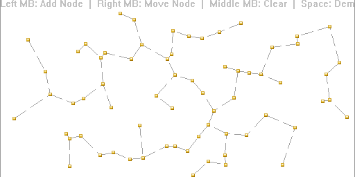



## Visual Minimum Spanning Tree

### Description

Simple Implementation of Prim's Algorithm for computing a Minimum Spanning Tree (MST). The GUI is ideal for demonstration purposes.

The MST is useful for efficiently solving some network design problems. An example might be a cable TV company laying cable to a new neighborhood, wanting to minimize total cable length.

Download is only 5 KB.
 
### More Info
 

             |
---                |---
**Submitted On**   |2006-10-07 08:20:02
**By**             |[ Stavros](https://github.com/Planet-Source-Code/PSCIndex/blob/master/ByAuthor/stavros.md)
**Level**          |Intermediate
**User Rating**    |5.0 (35 globes from 7 users)
**Compatibility**  |VB 6\.0
**Category**       |[Miscellaneous](https://github.com/Planet-Source-Code/PSCIndex/blob/master/ByCategory/miscellaneous__1-1.md)
**World**          |[Visual Basic](https://github.com/Planet-Source-Code/PSCIndex/blob/master/ByWorld/visual-basic.md)
**Archive File**   |[Visual\_Min2023771072006\.zip](https://github.com/Planet-Source-Code/stavros-visual-minimum-spanning-tree__1-66725/archive/master.zip)

